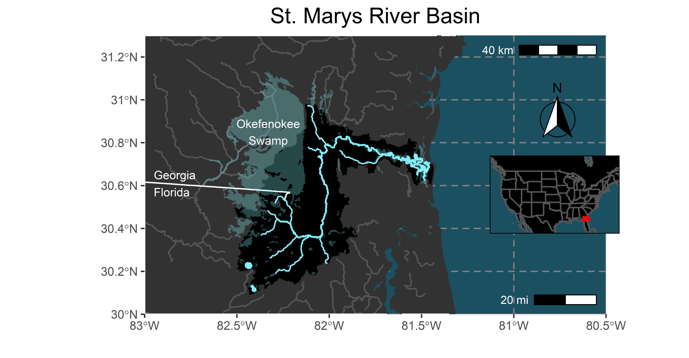

# Hidden Rivers of the United States
Scripts to plot river systems across the United States. Requires downloading several of large shapefiles. Data source info can be found in the script.

## Examples

drainage area: 3,379 mi2 (8,752 km2)
